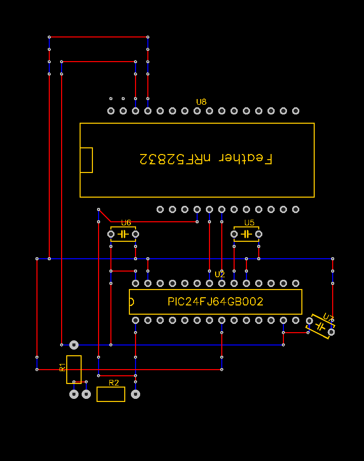

# PIC24 Flash Programmer

This allows programming a PIC24 microcontroller on Windows using an Arduino board. It was written specifically for the PIC24FJ64GB002 and that's all it's been tested with but it should work for other devices in the PIC24 family.

The project started using an Arduino Nano but switched to a Bluefruit Feather nRF52832 for the 3.3V I/O which just makes things easier. The Nano should work fine with some resistors for level shifting the 5V.

## Arduino

See https://github.com/gair/pic24-programmer

## Circuit

Refer to the [datasheet](https://ww1.microchip.com/downloads/aemDocuments/documents/OTH/ProductDocuments/DataSheets/39940d.pdf) for component information. The [perfboard](https://www.amazon.ca/YUNGUI-Solderable-Breadboard-70x90x1-6mm-Electronic/dp/B097F71C6G/ref=pd_day0fbt_img_sccl_2/136-0129052-4067474?pd_rd_w=3UNmH&content-id=amzn1.sym.e75e323b-7c97-47b7-9cf5-7363cb1f4533&pf_rd_p=e75e323b-7c97-47b7-9cf5-7363cb1f4533&pf_rd_r=7QN1DWPS2P6TQZHNW4YV&pd_rd_wg=j2W0v&pd_rd_r=8868ab32-162c-470b-ac49-317a48d2db0c&pd_rd_i=B097F71C6G&psc=1) below is based off the datasheet schematic. 

The Feather board is inverted in this circuit only because the one I got already had the headers soldered on that side. I would recommend having it the other way round if possible, to give access to the reset button.
